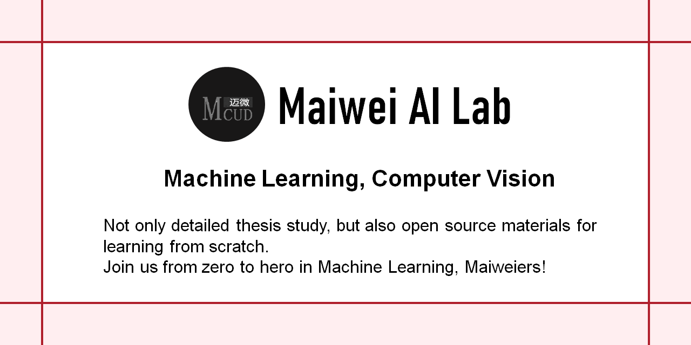

   
  
  
  
  

https://github.com/MaiweiAI

# PyTorching the Papers
https://github.com/Charmve/PyTorchingThePaper

<h2>Research Experience</h2>
	

	<table>
        <tr>   
		<td><b>1.</b></td>&nbsp;&nbsp;
		<td>

</td>
		<td>
			
                            <b>   Surface Defect Detection: Paper & Dataset</b>
				    
			
			 
			 Constantly summarizing open source dataset and important critical papers in the field of surface defect research are very important.
			   NEU-CLS, elpv-dataset, KolektorSDD, DeepPCB, AITEX, DAGM 2007, Cracks on the surface of the construction, Magnetic Tile, RSDDs Kylberg Texture, etc.
                        <ul class="list-inline">
                            <a class="github-button"
                                href="https://github.com/Charmve/Surface-Defect-Detection"
                                data-icon="octicon-star" data-show-count="true"
                                aria-label="Star Charmve/Surface-Defect-Detection on GitHub">Star</a>
                            <a class="github-button"
                                href="https://github.com/Charmve/Surface-Defect-Detection/fork"
                                data-icon="octicon-repo-forked" data-show-count="true"
                                aria-label="Fork Charmve/Surface-Defect-Detection on GitHub">Fork</a>
                       </ul>
		        
			    <a href="https://github.com/Charmve/Surface-Defect-Detection" target="_blank">https://github.com/Charmve/Surface-Defect-Detection</a>
		         
		</td>
	</tr>
	<tr>   
		<td><b>2.</b></td>&nbsp;&nbsp;
		<td>

</td>
		<td>
			
			    <b>  Mirror & Glass Detection in Real-world Scenes </b>
				    
			
		             
			        I'm more interested in detecting general glass surfaces that may not possess any special properties, 
				and am developing computational models for automatic detection and segmentation of mirror and transparent glass surfaces.
			     
				Thanks for <i>cs.cityu.edu.hk.</i>
			     
			    <ul class="list-inline">
                                 <a class="github-button"
                                     href="https://github.com/Charmve/Mirror-Glass-Detection"
                                     data-icon="octicon-star" data-show-count="true"
                                     aria-label="Star Charmve/Mirror-Glass-Detection on GitHub">Star</a>
                                 <a class="github-button"
                                     href="https://github.com/Charmve/Mirror-Glass-Detection/fork"
                                     data-icon="octicon-repo-forked" data-show-count="true"
                                     aria-label="Fork Charmve/Mirror-Glass-Detection on GitHub">Fork</a>
                            </ul>
			     
				<a href="https://github.com/Charmve/Mirror-Glass-Detection" target="_blank">https://github.com/Charmve/Mirror-Glass-Detection</a>
			      
			
		</td>
	</tr>
	<tr>   
		<td><b>3.</b></td>&nbsp;&nbsp;
		<td>

</td>
		<td>
			
			    <b>   SNE-RoadSeg2: Accurate Freespace Detection</b>
				    
			
			     
			        PyTorch implementation of <i>SNE-RoadSeg: Incorporating Surface Normal Information into Semantic Segmentation for Accurate Freespace Detection</i> <a href="http://www.ecva.net/papers/eccv_2020/papers_ECCV/papers/123750341.pdf" target="_blank">[Paper]</a>
			     
                            <ul class="list-inline">
                                <a class="github-button"
                                    href="https://github.com/Charmve/SNE-RoadSeg2"
                                    data-icon="octicon-star" data-show-count="true"
                                    aria-label="Star Charmve/SNE-RoadSeg2 on GitHub">Star</a>
                                <a class="github-button"
                                    href="https://github.com/Charmve/SNE-RoadSeg2/fork"
                                    data-icon="octicon-repo-forked" data-show-count="true"
                                    aria-label="Fork Charmve/SNE-RoadSeg2 on GitHub">Fork</a>
                            </ul>
			     
				<a href="https://github.com/Charmve/SNE-RoadSeg2" target="_blank">https://github.com/Charmve/SNE-RoadSeg2</a>
			      
			
		</td>
	</tr>
	<tr>   
		<td><b>4.</b></td>&nbsp;&nbsp;
		<td>

</td>
		<td>
			
				<b>   PaperWeeklyAI</b>
				    
			
			 
			        📚「MaiweiAI」Studying papers in the fields of computer vision, NLP, and machine learning algorithms every week.
			     
                            <ul class="list-inline">
                                <a class="github-button"
                                    href="https://github.com/Charmve/PaperWeeklyAI"
                                    data-icon="octicon-star" data-show-count="true"
                                    aria-label="Star Charmve/PaperWeeklyAI on GitHub">Star</a>
                                <a class="github-button"
                                    href="https://github.com/Charmve/PaperWeeklyAI/fork"
                                    data-icon="octicon-repo-forked" data-show-count="true"
                                    aria-label="Fork Charmve/PaperWeeklyAI on GitHub">Fork</a>
                            </ul>
			     
				<a href="https://github.com/Charmve/PaperWeeklyAI" target="_blank">https://github.com/Charmve/PaperWeeklyAI</a>
			      
			
		</td>
	</tr>
	<tr>   
		<td><b>5.</b></td>&nbsp;&nbsp;
		<td>

</td>
		<td>
			
				<b>   Light Cube: A Design of 3D Dynamic Display System Based on Voice Control</b>
				    
			
			 
			        In this paper, a 3D dynamic display system based on voice control is presented, which solves the existing light cube display color single, low resolution, poor human-computer interaction performance, complex design, high cost, etc.
			     <a href="https://github.com/Charmve/Design-of-a-3D-Dynamic-Display-System-Based-on-Voice-Control/blob/master/02_Design%20Report/%E3%80%8A%E5%9F%BA%E4%BA%8EFPGA%E7%9A%84%E6%99%BA%E8%83%BD%E8%AF%AD%E9%9F%B33D%E5%8A%A8%E6%80%81%E6%98%BE%E7%A4%BA%E7%B3%BB%E7%BB%9F%C2%B7%E8%AE%BE%E8%AE%A1%E6%8A%A5%E5%91%8A%E3%80%8B.pdf" target="_blank">[PDF Chinese]</a>
			     
                            <ul class="list-inline">
                                <a class="github-button"
                                    href="https://github.com/Charmve/Design-of-a-3D-Dynamic-Display-System-Based-on-Voice-Control"
                                    data-icon="octicon-star" data-show-count="true"
                                    aria-label="Star Charmve/Design-of-a-3D-Dynamic-Display-System-Based-on-Voice-Control on GitHub">Star</a>
                                <a class="github-button"
                                    href="https://github.com/Charmve/Design-of-a-3D-Dynamic-Display-System-Based-on-Voice-Control/fork"
                                    data-icon="octicon-repo-forked" data-show-count="true"
                                    aria-label="Fork Charmve/Design-of-a-3D-Dynamic-Display-System-Based-on-Voice-Control on GitHub">Fork</a>
                            </ul>
			     
				<a href="https://github.com/Charmve/Design-of-a-3D-Dynamic-Display-System-Based-on-Voice-Control" target="_blank">https://github.com/Charmve/Design-of-a-3D-Dynamic-Display-System-Based-on-Voice-Control</a>
		              
			
		</td>
	</tr>
	<tr>   
		<td><b>6.</b></td>&nbsp;&nbsp;
		<td>

</td>
		<td>
			
			    <b>   Bluetooth LE-Security: Method, Tools and Stack</b>
				    
			
			 
			     
			       The dangers of Bluetooth Low Energy(BLE) implementations: Unveiling zero day vulnerabilities and security flaws in modern Bluetooth LE stacks.
			     
                            <ul class="list-inline">
                                <a class="github-button"
                                    href="https://github.com/Charmve/BLE-Security-Attack-Defence"
                                    data-icon="octicon-star" data-show-count="true"
                                    aria-label="Star Charmve/BLE-Security-Attack-Defence on GitHub">Star</a>
                                <a class="github-button"
                                    href="https://github.com/Charmve/BLE-Security-Attack-Defence/fork"
                                    data-icon="octicon-repo-forked" data-show-count="true"
                                    aria-label="Fork Charmve/BLE-Security-Attack-Defence on GitHub">Fork</a>
                            </ul>
			     
				<a href="https://github.com/Charmve/BLE-Security-Attack-Defence" target="_blank">https://github.com/Charmve/BLE-Security-Attack-Defence</a>
			      
			
		</td>
	</tr>
	</table>
	 
